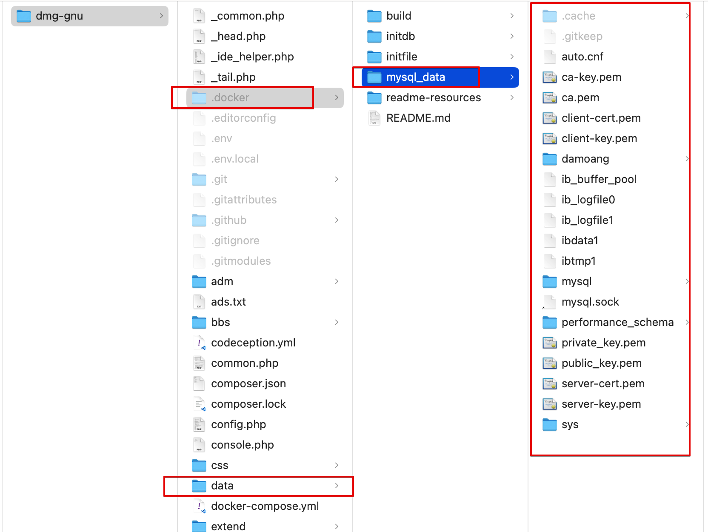
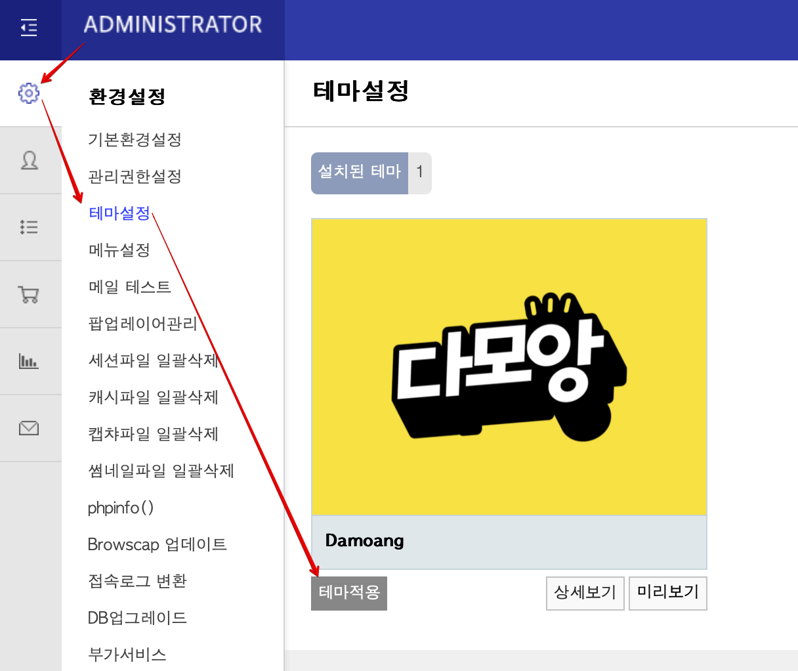
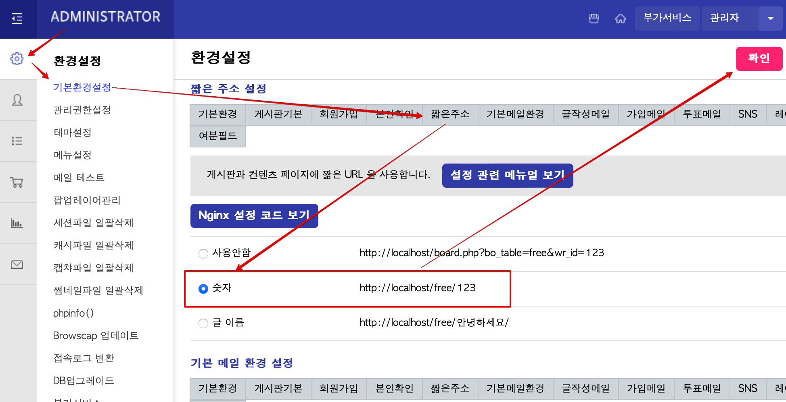
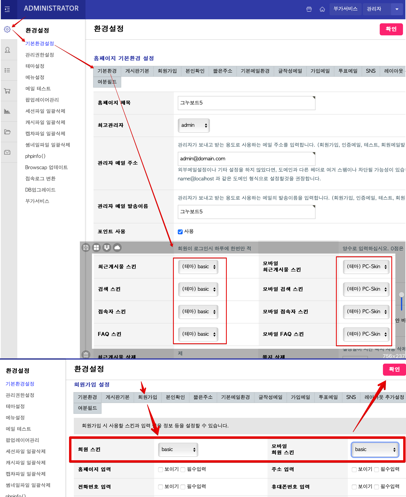
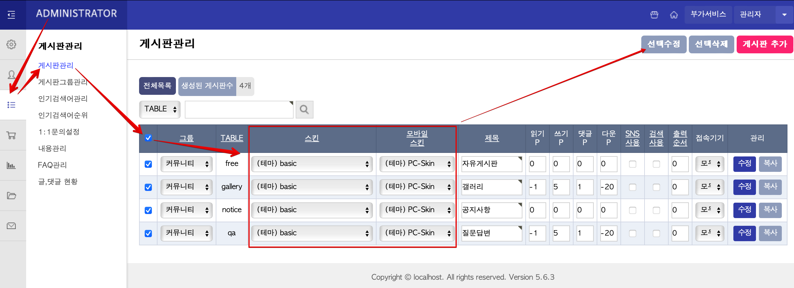
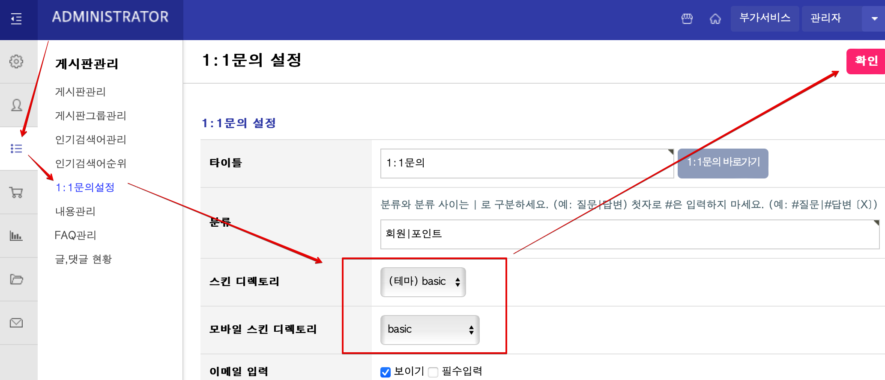
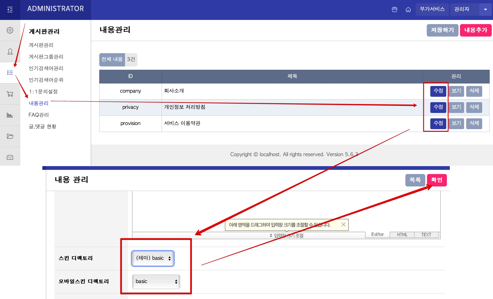
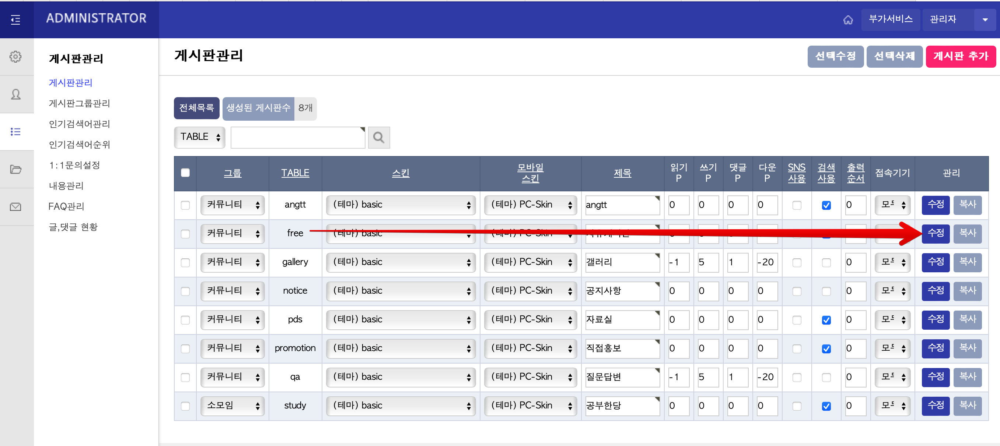
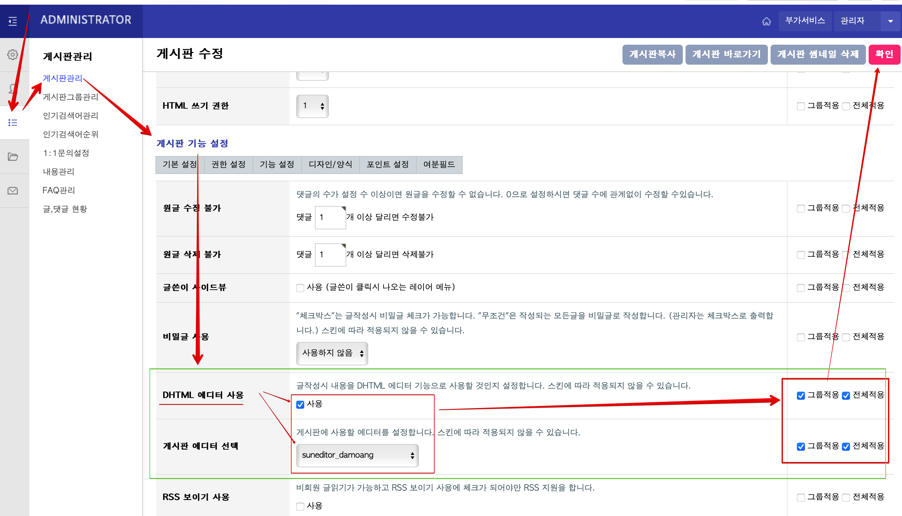
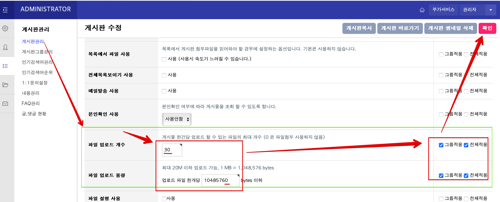

git submodule sync
git submodule update --init --recursive


 git config --global submodule.recurse true

git pull

---

<div align="center">

**🌍 다함께 모여 더욱 자유로운 세상, 다모앙. 🌍**

[](https://damoang.net)

</div>

---

# 다모앙 로컬 개발 환경 구축 및 코드 기여에대한 안내
본 레포지토리는 로컬 컴퓨터에 그누보드 개발환경을 구성하기위한 레파지토리입니다. 본 레포지토리에는 PHP/MySQL등 개발환경을 만드는 Docker Compose 구성이 포함되어있습니다. 다음 안내에 따라 Docker Compose를 실행하면 곧바로 관리자 및 더미회원이 구성된 개발환경이 시작됩니다.


## ◽ 레포지토리 Fork 및 Clone
1) 자신의 Github 계정으로 fork 할 때 모든 브랜치를 포함하여 fork 해주세요.
    > 단순히 로컬 테스트용이라면 fork/clone하지말고 본 레포를 '<strong>다운로드</strong>'만 하십시오.
2) fork한 레포지토리를 로컬컴퓨터의 적당한 위치에서 클론합니다. `git clone {github주소}`
    
3) 클론한 git root 폴더 `dmg-gnu`를 볼 수 있습니다.


## ◽ docker-compose로 시작하기

본 레포지토리를 다운로드 받은 `dmg-gnu` 폴더 아래에서 `docker-compose` 명령어를 실행합니다.   

```
$ cd /경로/dmg-gnu
$ docker-compose up -d
```
완료되면 다음 이미지들로 구성된 도커 컨테이너들이 묶음 실행됩니다. 

확인 명령어: $`docker ps`
 * da_nginx (80번포트)
 * da_php
 * da_mysql
 * da_phpmyadmin (8080포트)

### 사이트 접속 및 로그인
도커 컴포즈 빌드 후 곧바로 http://localhost/ 에 접속하면 DB 오류가 있을 수 있습니다. 이는 DB의 더미데이터를 덤프하는 중이라서 그렇습니다. 약 1분뒤에 다시 접속해보시기 바랍니다.


로그인 주소: http://localhost/bbs/login.php 
* ID/PW:
  * 관리자: admin/admin
  * 일반유저: user1~5/1234
  * 홍보게시판유저: user11~15/1234


## ◽ 로컬 Docker 환경에 대해서
본 레포지토리는 다음의 격리된 컨테이너 묶음 환경을 구성되어 있습니다.
* PHP 와 PHP Composer
* NginX 와 그누보드 라우트 설정
* phpMyAdmin 데이터베이스 관리도구 웹앱
* MySQL과 `gnuboad` db + 사이트 일부 설정값 더미 덤프데이터
* 더미 'data' 폴더 (그누보드 data 폴더: 로컬 DB 커넥션스트링,위젯/플러그인 데이터등등)


### phpMyAdmin
MySQL DB를 웹브라우저환경에서 수정할 수 있는 phpMyAdmin 도커 이미지가 8080포트로 포함되어있습니다. http://localhost:8080 으로 접속하면 phpMyAdmin을 이용할 수 있습니다. 패스워드는 MySQL 컨테이너와 같으며 다음 중 하나로 입력해 사용하면됩니다.

* ID: `root`, PW: `root123`
* ID: `user`, PW: `1234` 


## ◽ PHP Composer로 써드파티 PHP 라이브러리 설치
클론/다운로드 받은 직후에 `vendor` 폴더에 이미 필요한 모든 써드파티 라이브러리가 포함되어 있으므로 별도로 `composer install`` 할 필요없습니다.

관리되는 써드파티 라이브러리는 `dmg-gnu`폴더의 `composer.json/lock`` 파일에 명시되어있습니다. 


서버에 새롭게 적용해야할 써드파티 라이브러리를 추가했다면 사전에 알려서 운영서버에서도 설치될 수 있도록 해주세요.

> [!CAUTION]
> Composer가 관리하는 써드파티 라이브러리 모음인 `vendor` 폴더는 git으로 관리됩니다. 로컬에서 Composer로 업데이트하거나 설치해서 `vendor` 내용을 바꾸면 git push하면 함께 올라갑니다. 실제 서버에 적용해야할 라이브러리가 아니라면 제거해주시기 바랍니다.

wiki 참고 : [Composer 패키지 업데이트 시 주의사항 ](https://github.com/damoang/dmg-gnu/wiki/Composer-패키지-업데이트-시-주의사항-%E2%80%90-vendor)


## ◽ 코드작성 및 기여

`dmg-gnu` 레포를 fork한 자신의  github 레포지토리는 종종 `damoang/dmg-gnu` 버전에 맞춰 `sync` 한 뒤 로컬로 fetch/pull 해야합니다. 로컬에서 코드를 오래 묵힌 경우 그 사이 다른 사람이 변경한 파일이 충돌할 수 있으므로 최신판으로 fetch/pull 한뒤 되도록이면 충돌을 해결하고 push/PR 해주세요.


`main` 브랜치에서 작업(커밋)하기보다는, 별도의 브랜치를 만들어 작업해주세요.
~~~
git checkout main
git checkout -b {작업브랜치이름}
~~~

`dmg-gnu` 소스를 변경하면 로컬사이트에 반영됩니다. 안된다면 docker를 재시작 합니다:
~~~
 docker-compose restart
~~~

#### Push
~~~
git push origin {작업브랜치이름}
~~~

Github에 푸시 후 PR을 생성하면 됩니다. 수정한 내용을 반영하는 PR 제목을 써주세요 (릴리즈노트에 기록됩니다).


## ◽ 백업 및 복원
아래 파일들은 docker-compose 로 빌드했을 때 추가되지만, git으로 관리되지는 않으므로 빌드 이후로 로컬에서 추가한 사이트 데이터들을 백업하려면 따로 복사하여 보관하면 됩니다:

* 숨김 폴더인 `/.docker` 하위의 `mysql_data` 폴더
* `dmg-gnu` 하위의 `data` 폴더


본 레포를 다시 다운로드/Clone 받았을 경우 위의 <strong>'◽ docker-compose로 시작하기'</strong>로 도커를 다시 빌드한 뒤, 백업해 놓은 폴더내용으로 바꿔넣고 도커 컴포즈를 재시작해주세요.
 $`docker-compose restart`


 

# ◽ 다모앙 설정 안내
아래 설정은 대부분 더비데이터로 이미 적용될 것입니다. 단지 참조용으로 이전 내용을 남겨둡니다.

## ◽ 관리자 페이지 설정
컨테이너 묶음이 구성된 후 이 환경에는 DB 데이터가 없으므로 별도의 테마 관리자 설정값을 다음과같이 맞추어야합니다.

###  다모앙 테마로 설정
[관리자페이지 - 환경설정 - 테마설정] 에서 `다모앙` 테마로 선택 


###  짧은주소 설정
관리자페이지 - 환경설정 - 기본환경설정 - 짧은주소 : `숫자`로 선택


### 스킨 설정
- [관리자페이지 - 환경설정 - 기본환경설정]

  - 기본환경
    - 최근게시물 스킨 : **(테마) basic** / 모바일 최근게시물 스킨 : **(테마)PC-Skin**
    - 검색 스킨 : **(테마) basic** / 모바일 검색 스킨 : **(테마)PC-Skin**
    - 접속자 스킨 : **(테마) basic** / 모바일 접속자 스킨 : **(테마)PC-Skin**
    - FAQ 스킨 : **(테마) basic** / 모바일 FAQ 스킨 : **(테마)PC-Skin**

  - 회원가입
    - 회원 스킨 : **basic** / 모바일 회원 스킨 : **basic**
    > [!CAUTION]
    > 이러한 회원가입 스킨설정은 다모앙 실제서버와 다릅니다. 다모앙이 SNS 로그인을 사용하기에 관리자 로그인이 풀렸을 때 일반 로그인을 할 수 있는 화면이 없습니다. 로컬 개발환경에서는 ID/PW 로그인 화면이 필요할 것이므로 **회원가입**의 테마는 그누보드 코어 기본인 **basic**으로 설정합니다. 

- [관리자페이지 - 게시판관리]
  - 게시판관리
    - 
    - 모든 게시판 스킨 : **(테마) basic**
    - 모든 모바일 스킨 : **PC-Skin**
    - (이후 생성하는 모든 게시판도 동일)

  - 1:1문의설정
    - 
    - 스킨 디렉토리 : **(테마) basic**
    - 모바일 스킨 디렉토리 : **basic**

  - 내용관리 (주소가 /content/의 하위의 모든 페이지들)
    - 
    - 각각의 모든 '내용(content)' 페이지 수정
      - 스킨 디렉토리 : **(테마) basic**
      - 모바일스킨 디렉토리 : **basic**
      - (광고주 모음페이지인 광고앙 페이지는 ID가 `advertiser`인 페이지를 만들면 됩니다.)

### 글쓰기 에디터 설정
admin 패널에서 다모앙에디터(DHTML)를 사용하도록 설정하고 글쓰기 이미지 갯수/용량을 변경하세요.

- [관리자페이지 - 게시판관리 - (게시판)수정]
  - 
  - (게시판 기능설정): DHTML 사용
    -   
  - (게시판 기능설정): 용량
    - 

### /content - 게시판글이 아닌 페이지 설정
그누보드는 게시판이나 게시글이 아닌 별도의 `내용(content)`이라는 페이지를 만들 수 있습니다. admin 패널에서 `내용 관리` 에서 페이지를 추가할 수 있습니다. 여기에 추가하는 페이지들은 `/content/` 하위에 나타나는 페이지들(예: 약관,광고앙 페이지)이며, `dmg-gnu` 코드에서 `theme/damoang/page/` 하위에서 각각의 php 파일로 HTML 출력을 덮어쓸 수 있습니다.

 예를들어 '광고앙'페이지를 추가하려면 '내용관리'에서 id가  `advertiser`인 페이지를 추가하는 것만으로도 `theme/damoang/page/`하위에  `advertiser.php` 파일이 있으므로 `http://localhost/content/advertiser`에서 바로 볼 수 있습니다.


## ◽ 문제해결
### 만약 테마 관련 설정이 저장되지 않는다면
- theme 폴더 및 하위 폴더들을 쓰기 가능하게 권한 수정

### 로그인이 풀렸을 때
위에 설명한대로 '스킨 설정'의 '회원 가입' 스킨을 실제 다모앙과 다르게 했을 것이므로 아래처럼 로그인할 수 있습니다:
- `/bbs/login.php` 또는 `/adm` 으로 접속 시도하면 로그인 후 이용해 달라는 안내 후  ID/PW 입력 로그인 화면이 나옵니다.
- ID/PW 입력 로그인 화면을 찾을 수 없을 때는 `http://localhost:8080` 의 phpMyAdmin으로 접속하여 `gnuboard` db -> `g5_config` 테이블의 `cf_member_skin` 과 `cf_mobile_member_skin` 칼럼의 값을 `basic` 으로 설정 후 재시도

### 도커 컨테이너 환경을 직접 변경하려면
`dmg-gnu` 폴더에서 적절한 명령어를 사용하여 접속할 수 있습니다.
* MySQL 컨테이너 접속
    *  `docker exec -it da_mysql mysql -uroot -p`
    * PW: `root123`
* PHP 컨테이너 접속
    * `docker-compose exec da_php /bin/bash`


---
# 이전 README.md 내용 백업
## A) 도커 환경으로 시작하기
 로컬 컴퓨터에 Docker가 설치되어있다면 [damoang/docker-local](https://github.com/damoang/docker-local) 레포지토리의 README 안내를 따라 주세요.

## B) 직접 개발환경 구축하기
 (웬만하면 A방법을 이용하세요.)
 그누보드가 실행되기위해서는 php,NginX, MySQL이 로컬 컴퓨터에 설치되고 실행되어 있어야합니다. 환경이 구성된 후 그누보드 및 다모앙 테마설치에대한 내용은 지금은 아카이브된 `theme` 레포지토리의 [install.md](https://github.com/damoang/theme/blob/main/INSTALL.md)에서 읽어 볼 수 있습니다.


